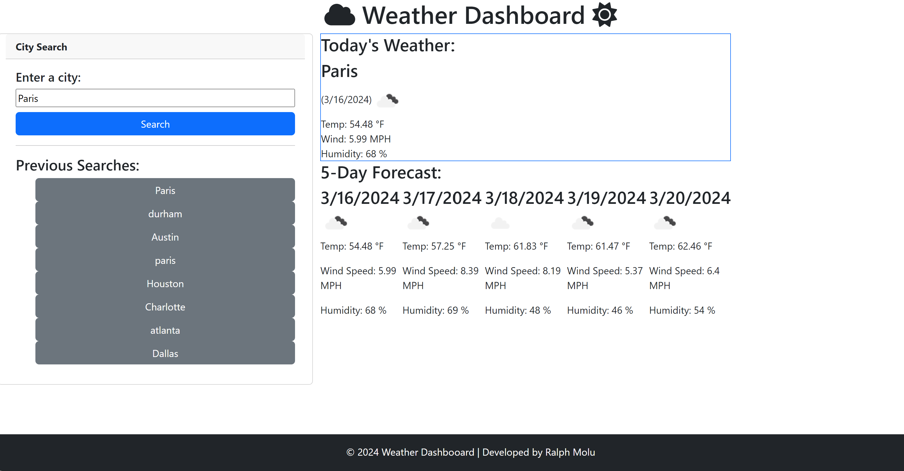

# Weather-Dashboard 🌤️

## Description 📖

Navigating weather conditions is crucial yet challenging, especially when planning travel. The Weather Dashboard aims to simplify this process, offering real-time weather updates and a five-day forecast for cities across the US. Utilizing the [OpenWeather API](https://openweathermap.org/api) this application provides essential weather details including temperature, wind speed and humidity. Designed for ease of use across various devices, the dashboard ensures your travel decisions are informed and well-prepared.


## Table of Contents 📚

* [App Preview 👀](#app-preview-👀)
* [Code-Snippet 💻](#code-snippet-)
* [Features✨](#features-✨)
* [Skills-Improved 🛠️](#skills-improved-🛠️)
* [Future Improvements 🔜](#future-improvements-🔜)
* [Technologies 🔧](#technologies-🔧)
* [License 📄](#license-📄)
* [Author 👤](#author-👤)


## App Preview 👀



## Features ✨

- Real-Time Weather Updates: Access current weather conditions including temperature, wind speed, and humidity.
- Five-Day Forecast: Plan ahead with a comprehensive five-day weather outlook.
- Search History: Conveniently revisit your recent searches with one click, powered by local storage functionality.


## Code-Snippet 💻

JavaScript

The function that fetches weather data from [OpenWeather API](https://openweathermap.org/api) and displays current and forecast weather

```JavaScript
// this function takes the user input, fetches the coordinates of the city entered and returns the weather using the coordinates
function getWeather() {

    //clear existing data in the container
    $("#currentWeatherContainer").empty();
    $("#forecastContainer").empty();
    
    var cityInput = $("#cityInput").val();
    saveSearch(cityInput);
    var citySearchURL = `https:api.openweathermap.org/data/2.5/forecast?q=${cityInput},${countryCode}&appid=${APIKey}`;

    var icon = $("");

    fetch(citySearchURL)
        .then(function (response) {
            return response.json();
        })
        .then(function (data) {
            console.log(data);

            //variables to store longitude (lon) and lattitude (lat) of entered city
            var lon = data.city.coord.lon;
            var lat = data.city.coord.lat;

            // using the geolocation to pull weather information
            var queryURL = `https://api.openweathermap.org/data/2.5/forecast?lat=${lat}&lon=${lon}&units=imperial&appid=${APIKey}`;

            fetch(queryURL)
                .then(function (response) {
                    return response.json();
                })
                .then(function (data) {

                    //display the date in simplified format from Unix Timestamp conversion
                    const date = new Date(data.list[0].dt * 1000); // convert unix seconds to milliseconds and store under Date object instance

                    //extracting date components
                    var month = date.getMonth() + 1; // months in this method are indexed starting at 0 for Jan, 1 for Feb...
                    var day = date.getDate();
                    var year = date.getFullYear();

                    var simplifiedDate = `${month}/${day}/${year}`;

                    var weatherIcon = data.list[0].weather[0].icon;
                    var iconSrc = "https://openweathermap.org/img/wn/" + weatherIcon + ".png";
                    icon.attr("src", iconSrc).attr("alt", "Weather Icon");

                    //create html tags, insert text from API response and store them in variables
                    var cityName = $("<h3>").text(data.city.name);
                    var currentTemp = $("<div>").text("Temp: " + data.list[0].main.temp + " °F");
                    var currentWindSpeed = $("<div>").text("Wind: " + data.list[0].wind.speed + " MPH");
                    var currentHumidity = $("<div>").text("Humidity: " + data.list[0].main.humidity + " %");

                    //append all API endpoints onto web app
                    $("#currentWeatherContainer").append(cityName);
                    $("#currentWeatherContainer").append(" (" + simplifiedDate + ")");
                    $("#currentWeatherContainer").append(icon);
                    $("#currentWeatherContainer").append(currentTemp);
                    $("#currentWeatherContainer").append(currentWindSpeed);
                    $("#currentWeatherContainer").append(currentHumidity);

                    //generating forecast weather cards
                    for (var i = 0; i < 5; i++) {

                        var dailyForecastCard = $("<div>");
                        var forecastData = data.list[i * 8];

                        //retreive the temp, the humidity, the wind speed, the date and the icon
                        var forecastTemp = forecastData.main.temp;
                        var forecastHumidity = forecastData.main.humidity;
                        var forecastWindSpeed = forecastData.wind.speed;
                        var newDate = new Date(forecastData.dt * 1000); // convert Unix timestamp to milliseconds
                        var forecastDate = newDate.toLocaleDateString(); // convert date to readable format
                        var forecastIconSrc = `https://openweathermap.org/img/wn/${forecastData.weather[0].icon}.png`;


                        //create HTML elements to display retrieved info
                        var forecastCard = $("<div>").addClass("forecastCard");
                        var displayDate = $("<h3>").addClass("card-title").text(`${forecastDate}`);
                        var displayIcon = $("").attr("src", forecastIconSrc).attr("alt", "Weather Icon");
                        var displayTemp = $("<p>").addClass("card-text").text(`Temp: ${forecastTemp} °F`);
                        var displayWindSpeed = $("<p>").addClass("card-text").text(`Wind Speed: ${forecastWindSpeed} MPH`);
                        var displayHumidity = $("<p>").addClass("card-text").text(`Humidity: ${forecastHumidity} %`);

                        //make retrived infor visible
                        forecastCard.append(displayDate);
                        forecastCard.append(displayIcon);
                        forecastCard.append(displayTemp);
                        forecastCard.append(displayWindSpeed);
                        forecastCard.append(displayHumidity);
                        $("#forecastContainer").append(forecastCard);

                    }
                })
        });
}});
```


Function that saves user entries in a search history

```JavaScript
function saveSearch(cityName){
    //prevent empty searches from being saved
    if (!cityName){
        return;
    }

    var searchHistory = []; // empty array that will store search history
    var storedHistory = localStorage.getItem('searchHistory'); // retrieve stored history.

    // if there are items in the search history, parse them and place them in the searchHistory array
    if (storedHistory !== null){
        searchHistory = JSON.parse(storedHistory);
    }

    // prevent duplicates in the search History
    var index = searchHistory.indexOf(cityName);
    if (index !== -1){
        searchHistory.splice(index, 1); // start deleting from "index", delete count 1
    }
    searchHistory.unshift(cityName);

    //control the length of searchHistory by deleteing the last entry
    if (searchHistory.length > 8){
        searchHistory.pop(); 
    }

    localStorage.setItem('searchHistory', JSON.stringify(searchHistory));
    displaySearchHistory();
}

```

## Skills Improved 🛠️
✔️ Server Side APIs\
✔️ Open Weather API\
✔️ Bootstrap\
✔️ Font Awesome\
✔️ jQuery

## Future Improvements 🔜

* Add Crime data for searched city
* Show results of the last city search upon opening the page
* UI/UX improvements (background image, corresponding weather audio and or animation)
* Refactoring

## Technologies 🔧

* [HTML](https://developer.mozilla.org/en-US/docs/Web/HTML)
* [CSS](https://developer.mozilla.org/en-US/docs/Web/CSS)
* [JavaScript](https://developer.mozilla.org/en-US/docs/Web/JavaScript)
* [jQuery](https://jquery.com/)
* [Bootstrap](https://getbootstrap.com/)
* [Font Awesome](https://fontawesome.com/)

## License 📄
This project is licensed under the MIT License - see the LICENSE for details.

## Author 👤

* **Ralph Molu** 

- [Portfolio](#)
- [Github](https://github.com/ralphmolu)
- [LinkedIn](https://www.linkedin.com/in/ralph-molu/)

